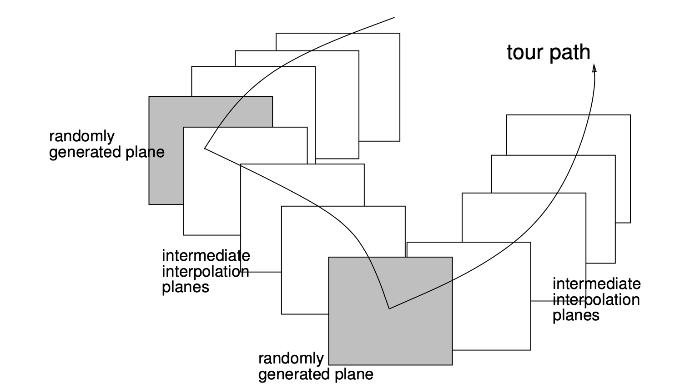

```{r setup, include=FALSE}
knitr::opts_chunk$set(echo = FALSE)
library(tidyverse)
load(here::here("data/temp.rda"))
```


# Introduction

## Tour

Tour provides a way to explore multivariate data interactively via an established tour path. A tour path is formed by interpolating between randomly generated plane. Different types of tours are available depends on the purpose of the exploration i.e. a grand tour is suitable for randomly exploring the data from different angles; a guided tour detects a particular structure in the data. a manual tour allows user to manually control the projection @cook1997manual. 

## Guided tour

Guided tour is usually used in conjunction projection pursuit, a method coined by @friedman1974projection to detect "interesting" low-diemsion projection of multivariate data. A projection pursuit requires the definition of a projection pursuit index function and an optimisation routine. The projection pursuit index measures the "interestingness" of data defined as its departure from normality. Numerous indices have been proposed in the literature, including lengendre index @friedman1974projection, hermite index @hall1989polynomial, natural hermite index @cook1993projection, chi-square index @posse1995projection, LDA index @lee2005projection and PDA index @lee2010projection. An optimisation routine is required to find the projection basis (thus projection) that maximises the projection pursuit index. The discussion of existing optimisation procedure will be discussed in the next section.

Guided tour creates visualisation for the projections found by projection pursuit by constructing a tour path. An illustration from @buja2005computational entails the geodesic interpolation bewteen the plane generated by projection pursuit.



## Optimisation methods existing in tourr

Because of the fact that projection pursuit index can be non-differentiable and that the projection basis is constrained to be orthonormal, the optimisation need to be a derivative-free, constrained procedure. Also, local maxima is equally interested as global maxima since it reveals distinct local structure in the data. Posse @posse1995projection presented a random search algorithm that samples new basis in the neighbourhood of the current basis. The neighbourhood is defined via the radius of the p-dimenionsal sphere, $c$. The new basis is taken as the target basis if it has higher index value, or the sampling continues. If no basis is found to have higher index value after a certain humber of tries $n$, the radius $c$ is halved. The algorithm stops when the maximum numbere of iteration is attained or the radius $c$ is less than a pre-determined number. [Pursuit package uses this method and it works greate! But I don't think we implement this - although don't think it is too hard to do it]. 

Cook @cook1995grand explained the use of a gradient ascent optimisation with the assumption that the index function is continuous and differentiable. Since some indices could be non-differentiable, the computation of derivative is replaced by a psudo-derivative of evaluating five randomly generated directions in a tiny nearby neighbourhood. Taking a step on the straight derivative direction has been modified to maximise the projection pursuit index along the geodesic direction. 

Simulated annealing @lee2005projection @klein1989experiments is a non-derivative procedure based on a cooling *temperature* parametere $T_i$. Given an initial $T_0$, the temperature at iteration $i$ is defined as $T_i = \frac{T_0}{log(i + 1)}$. The simulated annealing algorithm works as follows. Given a proportion $p$ and a randomly generated orthonormal basis $B'$, a candidate basis is constructed as $(1- p)B + p B'$ where $B$ is the current basis. If the index value of the candidate basis is larger than the one of the current basis, the candidate basis becomes the target basis. If it is smaller, the candidate is accepted with probability $A = \min \left(\exp(\frac{I(B) - I(B')}{T_i}), 1 \right)$ where $I(.)$ is the index function. 

    [The mathmetical expression is from Lee 2005 - without a negative in the $\exp$ but in the initial paper where SA is proposed 
    @article{bertsimas1993simulated,
      title={Simulated annealing},
      author={Bertsimas, Dimitris and Tsitsiklis, John and others},
      journal={Statistical science},
      volume={8},
      number={1},
      pages={10--15},
      year={1993},
      publisher={Institute of Mathematical Statistics}
    }
    ,
    
    @article{kirkpatrick1983optimization,
      title={Optimization by simulated annealing},
      author={Kirkpatrick, Scott and Gelatt, C Daniel and Vecchi, Mario P},
      journal={science},
      volume={220},
      number={4598},
      pages={671--680},
      year={1983},
      publisher={American association for the advancement of science}
    }
    
    and 
    
    @article{klein1989experiments,
      title={Experiments in projection and clustering by simulated annealing},
      author={Klein, Raymond W and Dubes, Richard C},
      journal={Pattern Recognition},
      volume={22},
      number={2},
      pages={213--220},
      year={1989},
      publisher={Elsevier}
    }
    
    The definition of $T_i$ is $T_i = \exp(-\frac{\Delta I}{k T})$ - with negative in the $\exp$. It is the gibb/boltzman distribution!]


## problems experienced with existing versions

- the simulated annealing algorithm doesn't include the acceptance probability 

- is `search_geodesic` widely known in the research community - doesn't seem to find paper introducing this except (Cook, 1995). Any tools available to  better understand its searching process?

- it is not understood how the index value changes during interpolation - is any interpolating basis better candidate for the next-round current basis than the target basis?

- How does the projected basis found by the optim look like? Are they close to each other/ far away? Any high-d or low-d vis of the projection basis?

- Do I want to introduce search_polish in this article?


# Recording the guided tour

## Tour components

Guided tour, along with other types of tour, has been implemented in the *tourr* package in R, available on the Comprehensive R Archive Network at [https://cran.r-project.org/web/packages/tourr/](https://cran.r-project.org/web/packages/tourr/) @wickham2011tourrpackage. A tour includes two major components: a *generator* that generating the projection basis according to projection pursuit and an *interpolator* that performing geodesic interpolation between the projection basis. 

The psudo-code below illustrates the implementation of guided tour in the tourr package. Given an projection pursuit index function and a randomly generated projection basis (current basis), the optimisation procedure produces a target basis inside `generator()`  Both the current basis and the target basis will be supplied to `tour_path()` to prepare information needed for constructing a geodesic path. This information is then used to compute a series of interpolating bases inside the `tour()` function. All the basis will be sent to create animation for visualising the tour in the `animate()` function.  


```{r eval = FALSE, echo = TRUE}
animation <- function(){
  
  # compute projection basis 
  tour <- function(){
    
    # construct bases on the tour path
    new_geodesic_path <- function(){
      tour_path <- function(){
        
        # GENERATOR: generate projection basis via projection pursuit
        guided_tour <- function(){
          generator <- function(){
            
            # define projection pursuit index
            # generate the target basis from the current basis via optimisation
          }
        }
        
        # prepare geodesic information needed for interpolating along the tour path
      }
    }
    
    # INTERPOLATOR: interpolate between the current and target basis 
    function(){
      # generate interpolating bases on the geodesic path
    }
  }
  
  # animate according to different display methods
}
```


## Data Structure

In the current implementation of the `tourr` package, while the target basis generated by the projection pursuit can be accessed later via `save_history()`, interpolating bases and those randonly nearby bases generated in the optimisation are not stored. This creates difficulties for fully understand the behaviour of the optimisation and interpolation of tour in complex scenario **[needa rephrase this part].** 

The global structure consists of six columnes: `basis`, `index_val`, `tries`, `info`, `loop`, `id` and captured all the basis generated during whole tour process. The first five rows of the record of a five-variable 1d projection is printed below. 

```{r eval = FALSE}
devtools::load_all()
set.seed(123456)
temp <- animate_dist(data, tour_path = guided_tour(holes(), d = 1,
                                           search_f =  search_geodesic),
                  rescale = FALSE, verbose = TRUE)

#save(temp, file = here::here("vignettes", "data", "temp.rda"))
```

```{r echo = TRUE}
temp %>% head(5)
```

`tries` has an increment of one once the generator is called (equivalently a new target basis is generated); `info` records the stage the basis is in. This would include the `interpolation` stage and the detailed stage in the optimisation i.e. `direction_search`, `best_direction_search`, `line_search`and `best_line_search` for geodesic searching (`search_geodesic`); `random_search` and `new_basis` for simulating annealing (`search_better`). `loop` is the counter used for the optimisation procedure and thus will be `NA` for interpolation steps. `id` creates a sequential order of the basis. This information will be stored and printed when the optimisation ends and can be turned off via `print = FALSE`. Additional messages during the optimisation can be displayed via `verbose = TRUE`. 


# Visual methods
## index vs time plots
## target basis vs interpolation steps, index vs time
## low-d representation, PCA

# Animating plots

# Finding errors and developing improvements
## interrupt
## polish

# Vis package
